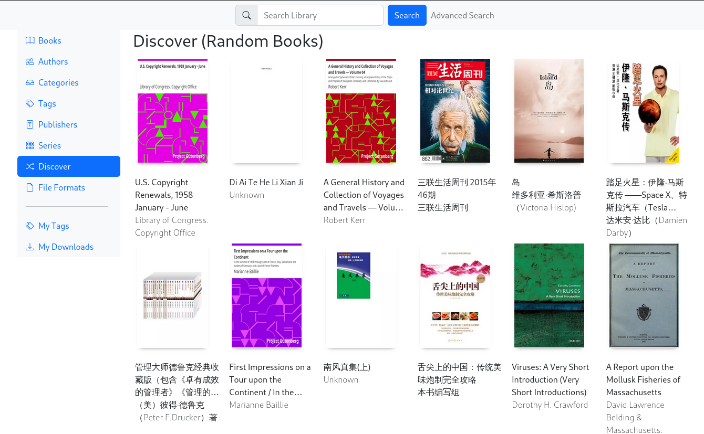

# About
![Build status][build-status]
![Minimum rustc version][rustc-version]

Personal ebook library.

Features:
- Support [CLC][clc], Chinese Library Classification a.k.a. 中图分类法
- Support tag hierachy
- Manage millions of books without latency

## How to deploy
The simple way is to deploy with docker-compose.
A template yaml file is located [here](docker/docker-compose.yml).
Modify it based on your environment.

Currently only PostgreSQL is supported.

## Import calibre library
To import calibre library, run `backend --bin import-library /path/to/calibre/library`. 

If it is deployed in docker, switch to docker app with `docker exec pengzu_pengzu_app_1 /bin/bash`
and run this command.
Remember to mount calibre library in volume.

## Screenshot

## License
This project is released in [General Public License](LICENSE).

[build-status]: https://github.com/PengzuLibrary/pengzu/actions/workflows/rust.yml/badge.svg
[rustc-version]: https://img.shields.io/badge/rustc-1.52+-yellow.svg
[clc]: https://en.wikipedia.org/wiki/Chinese_Library_Classification
